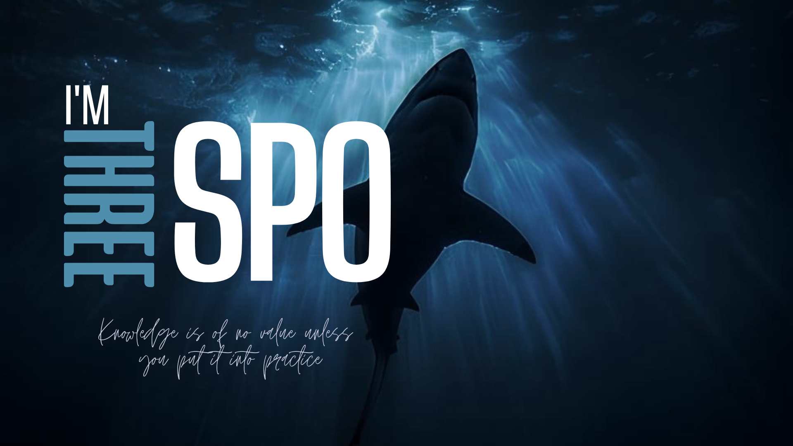

<!--HEAD-->

<!--HEAD-->


<!--SEPARATOR-->
   


<!--ABOUT ME-->
## <b> About Me</b>
<br>

```java 
public class THREESPO implements Developer {
     String[] pronouns = { "he", "him" };
     CoffeeLevel dailyCaffeineLevel = CoffeeLevel.HIGH;

     // Areas of interest
     String[][] focus = {
          { "Java", "C/C++", "Python", "Web" }, // Back-end
          { "Bash", "Linux", "Web Security" }
          // Work in progress...
     };

     String funFact = "Still learning... and breaking things.";
     private int publicRepos = 12; // ...for now ;)

     @Override
     public void whoAmI() {
          System.out.println("Just a .dev...");
     }
}

enum CoffeeLevel {
    LOW, MEDIUM, HIGH
}

interface Developer {
     void whoAmI();
}
```
<br>
<!--ABOUT ME-->


<!--SOCIAL-->
## <b> Socials</b>

<div>

   
   
   
   
   
   
</div>

<br>
<!--SOCIAL-->


<!--SKILLS-->
## <b> Full Stack & Technologies</b>
<div>
   


<!--  -->
</div>
<br>

## <b> Developer Toolkit</b>
<div>


</div>
<br>

## <b> Environment & Utilities</b>
<div>


 


</div>
<br>
<!--SKILLS-->


<!--STATS: shadow_red, nord-->
##  <b>Github Stats</b>

<div align="center" style="width: 100vw; overflow-x: auto;">
  
</div>

<br>

<!--STATS-->
<!--THE END-->


<!--SEPARATOR

<br>
-->


<!--FOOTER
<div align="center">
   <em align="center">Errare umanum est perseverare autem diabolicum...
   </em>
</div>
-->
